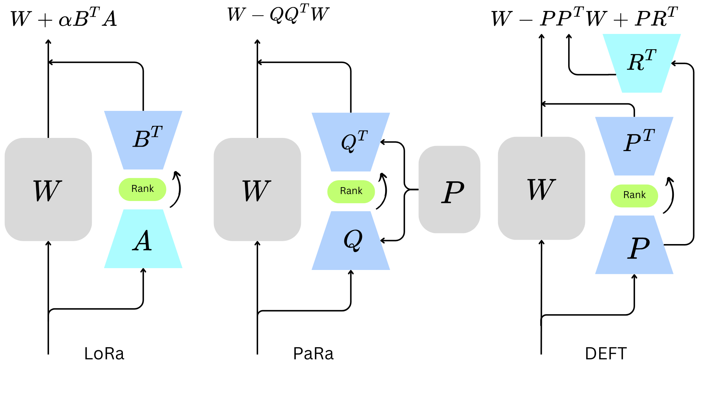

# DEFT
Emergent Properties of Efficient Fine-Tuning in Text-to-Image Models


## Overview
In this work, we introduce DEFT, Decompositional Efficient Fine-Tuning, an efficient fine-tuning
framework that adapts a pre-trained weight matrix by decomposing its update into
two components with two trainable matrices: (1) a projection onto the complement
of a low-rank subspace spanned by a low-rank matrix, and (2) a low-rank update.
The single trainable low-rank matrix defines the subspace, while the other trainable
low-rank matrix enables flexible parameter adaptation within that subspace. We
conducted extensive experiments on the Dreambooth and Dreambench Plus datasets
for personalization, the InsDet dataset for object and scene adaptation, and the
VisualCloze dataset for a universal image generation framework through visual
in-context learning with both Stable Diffusion and a unified model. Our results
demonstrated compatative performance and highlights the emergent properties of
efficient fine-tuning.

## Quick strart
### To create enviroment please follow the [./docs/enviroment.md#enviroment-details](https://github.com/MAXNORM8650/DEFT/blob/main/docs/enviroment.md)

## Adding DEFT layer to pretrained model
```bash 
import torch.nn as nn
import copy
from OmniGen import OmniGenPipeline
from deft.deft import KnowledgeInjectionConfig, make_knowledge_injection_adapter, add_knowledge_injection_methods
pipe = OmniGenPipeline.from_pretrained("Shitao/OmniGen-v1")
config = KnowledgeInjectionConfig(r=16, injection_method="residual_projection", target_modules=None, use_gating=True)
adapted_model = make_knowledge_injection_adapter(pipe.model, config)
adapted_model = add_knowledge_injection_methods(adapted_model)
adapted_model.save_pretrained("./knowledge_injection_adapter")
print("Adapted model saved and loaded successfully!")
```
## Training Omnigen using DEFT
### Please use --use_injection in finetuning
```bash
accelerate launch --num_processes=1 finetune.py --model_name_or_path Shitao/OmniGen-v1 \
 --batch_size_per_device 4 --condition_dropout_prob 0.01 --lr 1e-3 --use_injection --lora_rank 8 \
 --json_file ./toy_data/toy_subject_data.jsonl --image_path ./toy_data/images --max_input_length_limit 18000 \
 --keep_raw_resolution --max_image_size 1024 --gradient_accumulation_steps 1 --ckpt_every 100 --epochs 2000 --log_every 1 \
 --decomposition_method qr --results_dir ~/PP
 ```
Please refer to [docs/fine-tuning.md](docs/fine-tuning.md) for more details (e.g. full finetune).
## Approch


## From the method, we can use different decomposition methods.

### Results on emergent properties


### More Results

Additional results and visualizations can be found at the following links:

1. **DreamBench++ Comparison**: [https://anonymousdreambranchplus.netlify.app](https://anonymousdreambranchplus.netlify.app)

2. **OmniGen-VisualCloze**: [https://anonymouscloze.netlify.app/](https://anonymouscloze.netlify.app/)

3. **InstT Objects Qualitative Results**: [https://anonymousinstobjets.netlify.app](https://anonymousinstobjets.netlify.app)

## License
This repo is licensed under the [Apache License 2.0](LICENSE). 

## Citation
If you find this repository useful, please consider giving a star ⭐ and citation
```
@inproceedings{
kumar2025emergent,
title={Emergent Properties of Efficient Fine-Tuning in Text-to-Image Models},
author={Komal Kumar, Rao Muhammad Anwer, Fahad Shahbaz Khan, Salman Khan, Ivan Laptev, Hisham Cholakkal},
booktitle={The Thirty-ninth Annual Conference on Neural Information Processing Systems},
year={2025},
url={https://openreview.net/forum?id=R9xJSk5SQ2}
}
```